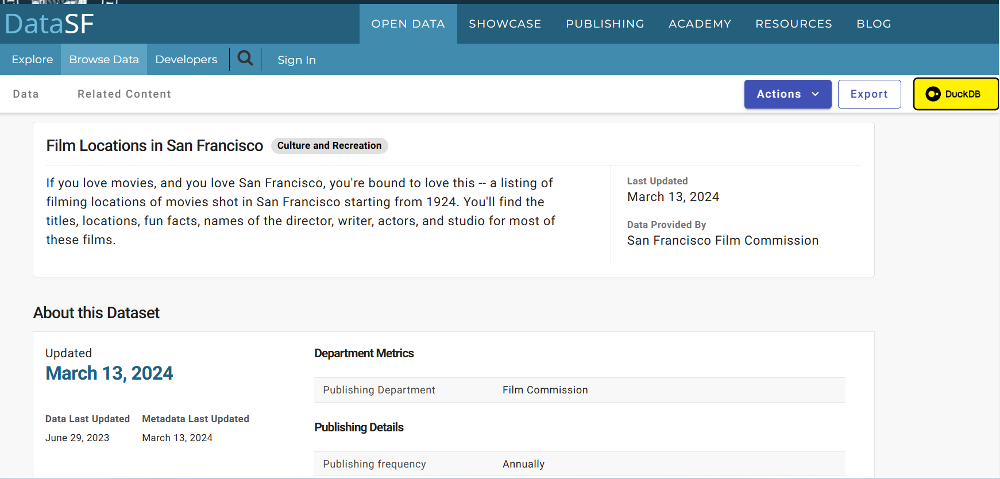
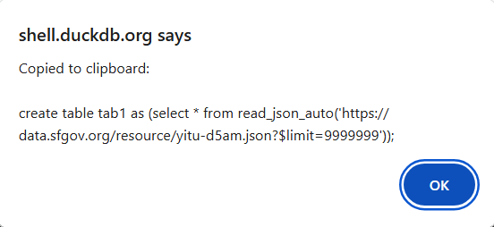
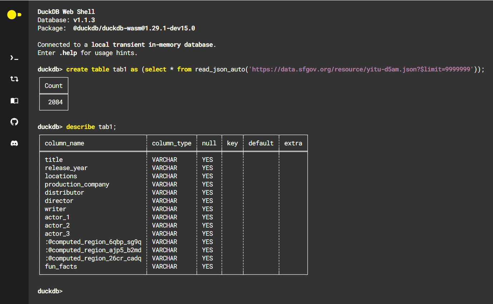

# DataSF to DuckDB

Chrom Extension that injects a button onto any 'About Data' page. Clicking the button opens https://shell.duckdb.org/ and sends a create table SQL statement to your clipboard with the appropriate API call.

